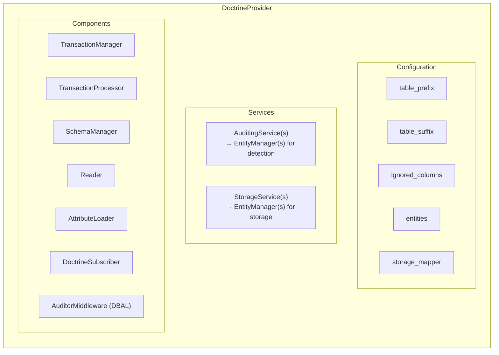

# DoctrineProvider

> **The Doctrine ORM provider for the auditor library**

The `DoctrineProvider` enables auditing for Doctrine ORM entities. It hooks into Doctrine's event system to detect changes and persist them as audit entries.

## 🔍 Overview

The DoctrineProvider:

- 📝 **Tracks entity changes** — Inserts, updates, and deletes
- 🔗 **Tracks relationships** — Many-to-many associations and dissociations
- 💾 **Persists audit logs** — Stores audits in dedicated audit tables via DBAL prepared statements
- 🔄 **Transactional integrity** — Audit entries are written within the same database transaction as your changes

## ✨ Key Features

### Automatic Change Detection

The provider hooks into Doctrine's `onFlush` event to automatically detect:

- **Insertions** — New entities being persisted and flushed
- **Updates** — Changes to existing entities with a full field-level diff
- **Deletions** — Entities being removed
- **Associations** — Many-to-many relationships being added
- **Dissociations** — Many-to-many relationships being removed

### Audit Table Structure

For each audited entity, a corresponding audit table is created:

| Column           | Type          | Description                                                       |
|------------------|---------------|-------------------------------------------------------------------|
| `id`             | `bigint`      | Auto-increment primary key                                        |
| `schema_version` | `tinyint`     | Diffs format version: `1` (legacy) or `2` (current)              |
| `type`           | `string(10)`  | Action type (insert/update/remove/associate/dissociate)           |
| `object_id`      | `string(255)` | ID of the audited entity                                          |
| `discriminator`  | `string(255)` | Entity class (for inheritance hierarchies)                        |
| `transaction_id` | `char(26)`    | ULID grouping related changes from the same flush                 |
| `diffs`          | `json`        | The actual changes — see [schema reference](schema.md)            |
| `extra_data`     | `json`        | Custom extra data (populated via listener)                        |
| `blame_id`       | `string(255)` | User identifier                                                   |
| `blame`          | `json`        | Blame context: `username`, `user_fqdn`, `user_firewall`, `ip`     |
| `created_at`     | `datetime`    | When the audit was created                                        |

### Action Types

| Type          | Description                                    |
|---------------|------------------------------------------------|
| `insert`      | A new entity was created                       |
| `update`      | An existing entity was modified                |
| `remove`      | An entity was deleted                          |
| `associate`   | A many-to-many relationship was added          |
| `dissociate`  | A many-to-many relationship was removed        |

## 🏗️ Architecture



## ⚠️ Limitations

> [!CAUTION]
> Important limitations to be aware of:

1. **DQL and raw SQL are not tracked** — `UPDATE` or `DELETE` queries executed via DQL (`$em->createQuery(...)`) or raw DBAL bypass the ORM's UnitOfWork and will not be audited. Always use `EntityManager::persist()` and `flush()`.
2. **Composite primary keys** — Not supported for auditing; each entity should have a single primary key.

## 📚 Sections

- [Configuration](configuration.md) — Configure the DoctrineProvider
- [Attributes](attributes.md) — Mark entities and fields for auditing
- [Services](services.md) — AuditingService and StorageService
- [Schema Management](schema.md) — Audit table management
- [Multi-Database](multi-database.md) — Store audits in a separate database

## 🚀 Basic Usage

```php
<?php

use DH\Auditor\Provider\Doctrine\Configuration;
use DH\Auditor\Provider\Doctrine\DoctrineProvider;
use DH\Auditor\Provider\Doctrine\Service\AuditingService;
use DH\Auditor\Provider\Doctrine\Service\StorageService;

// Create configuration
$configuration = new Configuration([
    'table_suffix' => '_audit',
    'entities'     => [
        App\Entity\User::class => ['enabled' => true],
        App\Entity\Post::class => ['enabled' => true],
    ],
]);

// Create provider
$provider = new DoctrineProvider($configuration);

// Register services — typically the same EntityManager for both
$provider->registerAuditingService(new AuditingService('default', $entityManager));
$provider->registerStorageService(new StorageService('default', $entityManager));

// Register with auditor
$auditor->registerProvider($provider);
```

---

## Next Steps

- ⚙️ [Configuration Reference](configuration.md)
- 🏷️ [Attributes Reference](attributes.md)
- 🔍 [Querying Audits](../../querying/index.md)
